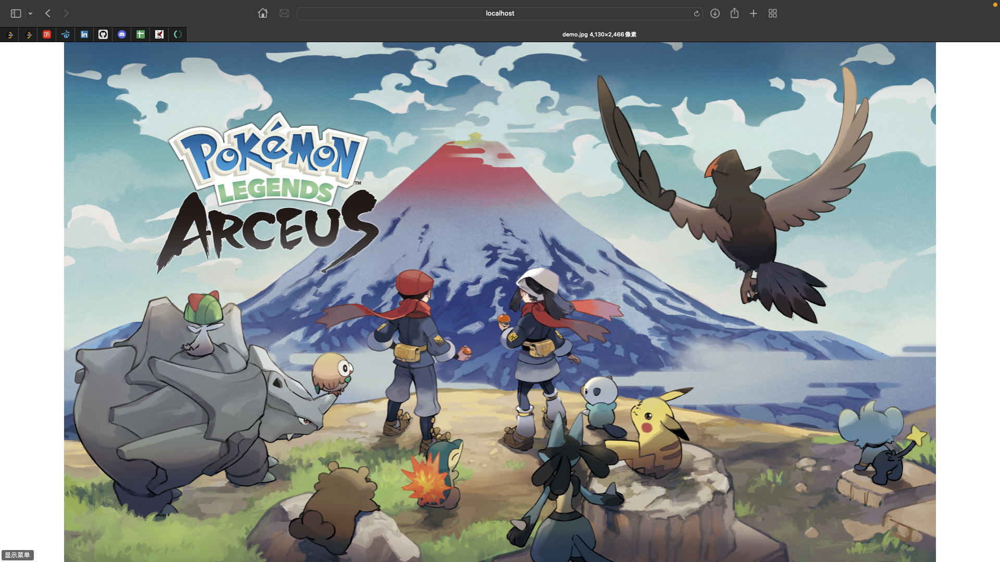

# 18845 Internet Service - Individual Project

## 1. Project Requirement

Part I:

> Implement a baseline concurrent Web server in C (recommended) or another language of your choice (be careful).

Part II:

> Design an efficient protocol for serving dynamic content, and then implement an optimized version of the baseline concurrent server that uses your protocol.

Part III:

> Evaluate the performance of your baseline and optimized servers, characterizing the performance improvement of your new server.

## 2. File Architecture

* cgi-bin : CGI program directory 

* dynamic-linking : dynamic linking library with four simplest chocice functions

* csapp.* / sbuf.* : reference code from CSAPP-3e

* demo.* : static resources

* home.html : static homepage

* dynamic.html : dynamic homepage

* tiny.* : basic version of tiny web server provided by CSAPP-3e

* mp.* : web server with **multiple process** (prefork)

* mt.* : web server with **multiple thread** (***baseline server***)

* tp.* : optimized version 1 based on mt.* with **thread pool**

* dl.* : optimized version 2 based on tp.* with **dynamic linking** (***optimized server***)

* Makefile 

## 3. Optimization

### Pre-thread 

* Same benefits as preforking

* Can also have the main thread do all the calls and hand off each client to an existing thread

### Thread Pool

* Maintain multiple threads waiting for tasks to be allocated for concurrent execution 
  
* Increase performance and avoid latency in execution due to frequent creation and destruction of threads for short-lived tasks

### Dynamic Linking

* Create shared library which can be loaded to any memory address when running or loaded, and linked with the program in the memory.
  
## 4. How To Use 

* Current Path:
        
        $ ./src

* Install & Uninstall:

        $ make                  # Install
        $ make clean            # Uninstall

* Compile Shared Library

        $ cd dynamic-linking
        $ gcc -shared -fpic -o libvector.so opt1.c opt2.c opt3.c opt.c
        $ cd ..

* Run Web Server: 
  
        $ ./tiny <PORT>         # Source 
        $ ./mp <PORT>           # Prefork
        ###  Baseline Server
        $ ./mt <PORT>           # Concurrent
        $ ./tp <PORT>           # Concurrent + Thread Pool
        ### Optimized Server
        $ ./dl <PORT>           # Concurrent + Thread Pool + Dynamic Linking 
 
* Server Test - Test Tool : Apach Benchmark (e.g. **PORT 8010**)

        $ cd Downloads/httpd-2.4.52/
        $ ab -n <TOTAL_REQUEST> -c <TOTAL_CLIENT> "<URL"
        
    * Static Test URL : http://localhost:8010/

    * Dynamic Test URL :
  
      CGI Program : http://localhost:8010/cgi-bin/oper=1&submit=submit

      Dynamic Linking : http://localhost:8010/dynamic-linking/1

* Find if a port is occupied:

        $ sudo lsof -i :<PORT>

* Close the port if needed:

        $ sudo kill -9 <PID>

## 5. Basic Effect

* Static Homepage & Resources :

* Dynamic Homepage :

* After Choosing :

* Runing Demo :

* Test Demo :

## 6. Evaluation

### Data Collection

* Comparison Across All Approaches
  

* Baseline Server vs. Optimized Server

