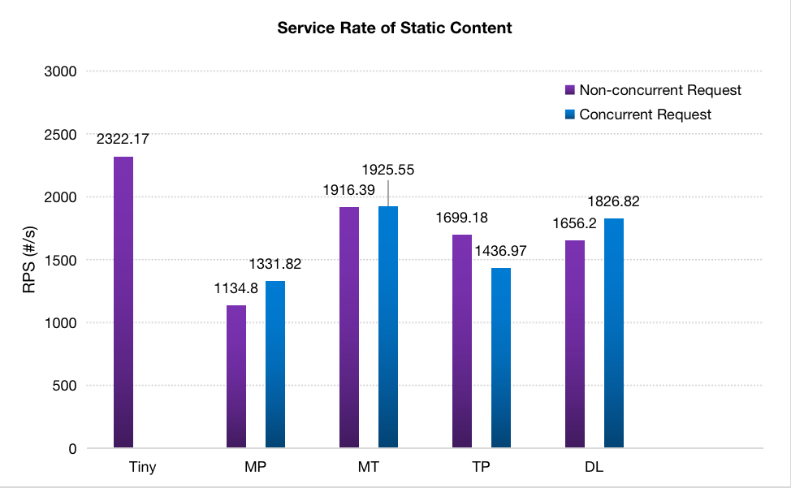

# 18845 Internet Service - Individual Project

## 1. Project Requirement

Part I:

> Implement a baseline concurrent Web server in C (recommended) or another language of your choice (be careful).

Part II:

> Design an efficient protocol for serving dynamic content, and then implement an optimized version of the baseline concurrent server that uses your protocol.

Part III:

> Evaluate the performance of your baseline and optimized servers, characterizing the performance improvement of your new server.

## 2. File Architecture

* cgi-bin : CGI program directory 

* dynamic-linking : dynamic linking library with four simplest chocice functions

* csapp.* / sbuf.* : reference code from CSAPP-3e

* demo.* : static resources

* home.html : static homepage

* dynamic.html : dynamic homepage

* tiny.* : basic version of tiny web server provided by CSAPP-3e

* mp.* : web server with **multiple process** (prefork)

* mt.* : web server with **multiple thread** (***baseline server***)

* tp.* : optimized version 1 based on mt.* with **thread pool**

* dl.* : optimized version 2 based on tp.* with **dynamic linking** (***optimized server***)

* Makefile 

## 3. Optimization

### Pre-thread 

* Same benefits as preforking

* Can also have the main thread do all the calls and hand off each client to an existing thread

### Thread Pool

* Maintain multiple threads waiting for tasks to be allocated for concurrent execution 
  
* Increase performance and avoid latency in execution due to frequent creation and destruction of threads for short-lived tasks

### Dynamic Linking

* Create shared library which can be loaded to any memory address when running or loaded, and linked with the program in the memory.
  
## 4. How To Use 

* Current Path:
        
        $ ./src

* Install & Uninstall:

        $ make                  # Install
        $ make clean            # Uninstall

* Compile Shared Library

        $ cd dynamic-linking
        $ gcc -shared -fpic -o libvector.so opt1.c opt2.c opt3.c opt.c
        $ cd ..

* Run Web Server: 
  
        $ ./tiny <PORT>         # Source 
        $ ./mp <PORT>           # Prefork
        ###  Baseline Server
        $ ./mt <PORT>           # Concurrent
        $ ./tp <PORT>           # Concurrent + Thread Pool
        ### Optimized Server
        $ ./dl <PORT>           # Concurrent + Thread Pool + Dynamic Linking 
 
* Server Test - Test Tool : Apach Benchmark (e.g. **PORT 8010**)

        $ cd Downloads/httpd-2.4.52/
        $ ab -n <TOTAL_REQUEST> -c <TOTAL_CLIENT> "<URL"
        
    * Static Test URL : http://localhost:8010/

    * Dynamic Test URL :
  
      CGI Program : http://localhost:8010/cgi-bin/oper=1&submit=submit

      Dynamic Linking : http://localhost:8010/dynamic-linking/1

* Find if a port is occupied:

        $ sudo lsof -i :<PORT>

* Close the port if needed:

        $ sudo kill -9 <PID>

## 5. Basic Effect

* Static Homepage & Resources :

* Dynamic Homepage :

* After Choosing :

* Runing Demo :

* Test Demo :

## 6. Evaluation

### Data Collection

* Comparison Across All Approaches
  

* Comparison Betwwen Baseline Server & Optimized Server

### Static Content

Since the optimization is not targeted at static contents, the original web server has the simplest mechanism and hence the highest service rate. Compared with servers adopted multiple thread optimization, prefork that utilized multiple process seems to be heavy-weighted because thread itself is more light-weighted than process.
When it comes to servers using thread pool and dynamic linking, actually the RPS flunctuation range is similar to that of basic concurrent server.

### Dynamic Content

Testing serial as well as concurrent requests to dynamic page, the result is very clear across all approaches (10000 Total Requests with 1 or 100 concurrent requests). The initial version of code from CSAPP:3e does not support concurrent requests so that I only conduct the non-concurrent tests on this server. It is surprising that although adopting optimized techniques, non-concurrent RPS of intermediate versions is not as good as the original version. However, the introduction of dynamic linking improve the RPS dramatically by approximately 8 times than baseline server. In addition, due to the setting of maximum threads in threading pool, RPS in the condition of concurrent is not as good as non-concurrent, which I will conduct further tests in the next paragraph.

### Baseline Server vs. Optimized Server

We can see the RPS of baseline server first improves as the concurrent requests increase until around 10 but decrease dramatically afterwards in that every time a request request arises, the server has to start a new thread to process the request. Hence, when the concurrent requests grows, the efficiency of multiple threading leads the RPS growing at the first time but with the approaching of boundaries, the server wastes more resources on managing thread life cycle manipulations.

The difference between baseline server and optimized server lies in two parts: threading poll and dynamic linking.  

Unlike baseline server, optimized server introduces thread pool which avoid re-creating or re-destructing threads but utilize existing running threads. Therefore, as concurrent requests grows rapidly, optimized server can adapt to the traffic by setting the maximum running threads at 100. Even if the concurrent requests exceed 100, the server would not add more threads but fully exploit existing threads. From the figure, we can see that the RPS decreasing ampltitude of optimized server (~15%) is far more smooth than baseline server (~85%).

The overall improvement of absolute values is much more obvious: With the shared library, server does not have to compile all existing fuctions but call related functions in the library the same as local functions.  

From the tail latency figure, we can conclude that optimize server can limit the 5% slowest request latency at linear growth as concurrent request growth with the help of thread pool. On the other hand, baseline server has to keep a portion of requests waiting so that the tail latency grows in a polynomial way.

#### Throughput

#### Tail Latency

